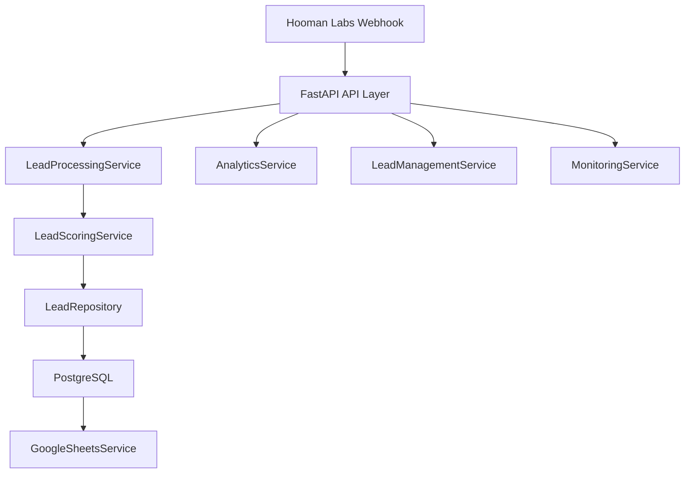
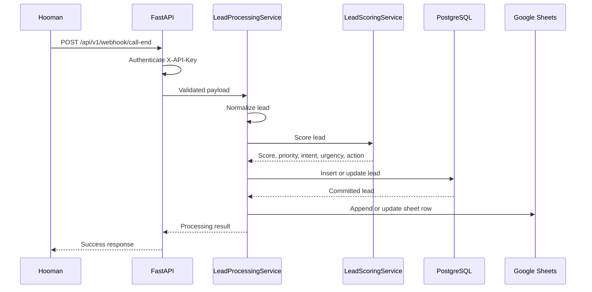

# TripGenie AI Backend

TripGenie AI Backend is a FastAPI service for receiving travel lead data from a Hooman Labs voice-agent webhook, validating it, scoring it, storing it in PostgreSQL, syncing committed leads into Google Sheets, and exposing production-ready management and analytics APIs. This repository currently implements Milestones 1 through 7.

## Features

- Secure Hooman call-end webhook ingestion.
- PostgreSQL persistence with SQLAlchemy and Alembic.
- Duplicate protection by `conversation_id`.
- Lead scoring, priority, booking intent, urgency, reason, summary, and follow-up action.
- Google Sheets synchronization as a lightweight operations CRM.
- Dashboard-ready analytics APIs.
- Lead management APIs with pagination, filtering, sorting, search, updates, and soft delete.
- Health, readiness, and liveness endpoints.
- Structured request logging and centralized error handling.
- Pytest test scaffold and Render deployment configuration.

## Architecture

The backend is intentionally simple and production-shaped:

- FastAPI owns HTTP routing and application lifecycle.
- Pydantic Settings owns environment-driven configuration.
- Python logging provides reusable application logging.
- SQLAlchemy 2.0 owns database models, engine creation, and sessions.
- Alembic owns schema migrations.
- Routes stay thin; future business logic belongs in `app/services`.



## Folder Structure

```text
backend/
|-- app/
|   |-- api/          # HTTP routers and API composition
|   |-- core/         # Configuration, constants, and logging
|   |-- db/           # Engine, session lifecycle, metadata, dependencies
|   |-- models/       # SQLAlchemy ORM models
|   |-- schemas/      # Future Pydantic request/response schemas
|   |-- services/     # Future business logic
|   |-- utils/        # Future shared utilities
|   `-- main.py       # FastAPI app factory and lifecycle hooks
|-- alembic/          # Database migration environment and versions
|-- tests/            # Future automated tests
|-- .env.example      # Required environment variables template
|-- .gitignore        # Local files excluded from source control
|-- alembic.ini       # Alembic configuration
|-- requirements.txt  # Python package dependencies
`-- README.md         # Project setup and design notes
```

## File-by-File Design Notes

`requirements.txt` pins the runtime dependencies used by the API, database, Google Sheets integration, and supporting services. Pinning versions keeps local development, CI, and Render deployment predictable.

`.gitignore` excludes virtual environments, caches, logs, and real `.env` files. `.env.example` remains tracked so setup is repeatable without exposing credentials.

`.env.example` documents all required settings. `DATABASE_URL` uses the SQLAlchemy PostgreSQL + psycopg format and should include `sslmode=require` for Neon.

`app/main.py` uses an app factory plus FastAPI lifespan hooks. Startup logs the application mode and verifies the database connection, so broken configuration fails before the service accepts traffic.

`app/core/config.py` centralizes configuration in a Pydantic Settings class. Environment variables are the only configuration source, and `DATABASE_URL` is required.

`app/core/logging.py` configures reusable console logging with timestamps, severity, logger name, and message. Future services can call `get_logger(__name__)`.

`app/core/constants.py` keeps default lead workflow values in one place instead of scattering repeated strings across the codebase.

`app/api/router.py` composes route modules behind the configured API prefix. This keeps versioning and route registration out of individual endpoint files.

`app/api/routes/root.py` provides a small service identity endpoint for humans and quick smoke checks.

`app/api/routes/health.py` runs `SELECT 1` through the injected database session. This verifies the API process and database connectivity together.

`app/api/routes/analytics.py` exposes dashboard metrics without mixing SQL aggregation into route handlers.

`app/api/routes/leads.py` exposes consultant-facing lead management while keeping update and soft-delete rules in `LeadManagementService`.

`app/db/base.py` defines the SQLAlchemy declarative base. All ORM models inherit from it so Alembic can discover metadata consistently.

`app/db/session.py` creates the PostgreSQL engine, session factory, request session generator, and startup connection verification. `pool_pre_ping=True` helps recover from stale cloud database connections.

`app/db/dependencies.py` exposes the database session as a FastAPI dependency. This gives each request its own session and keeps database wiring out of route code.

`app/models/lead.py` defines the `leads` table using SQLAlchemy 2.0 typed mappings. The table is designed for webhook ingestion, business intelligence, and operational workflows.

`alembic.ini` configures Alembic. The database URL is loaded from application settings in `alembic/env.py`, so migrations use the same environment-driven configuration as the app.

`alembic/env.py` imports model metadata and configures online/offline migrations. This is what lets Alembic compare ORM metadata to the database schema.

`alembic/versions/20260717_0001_create_leads_table.py` is the initial migration. It creates the PostgreSQL UUID extension, `leads` table, constraints, indexes, and an `updated_at` trigger.

`schemas/`, `services/`, `utils/`, and `tests/` establish clean ownership boundaries. Schemas define API contracts, services own business logic, and tests verify behavior without coupling routes to implementation details.

`render.yaml` documents the recommended Render web service configuration.

`CODE_QUALITY_REVIEW.md` records the production-readiness self-review and improvement backlog.

## Lead Model Design

The `leads` table uses a UUID primary key because webhook-driven systems often cross service boundaries. UUIDs avoid exposing row counts and remain safe when records are created across environments.

Field choices:

- `customer_name`: required `String(120)` because every qualified lead should identify the traveler.
- `phone`: required `String(32)` because phone numbers are identifiers, not numbers. It is indexed for lookup and deduplication workflows.
- `destination`: optional `String(120)` because a caller may be undecided. It is indexed for filtering.
- `travel_month`: optional `String(40)` because voice calls may capture natural values like `December` or `next May`.
- `travellers`: optional integer with a positive check constraint.
- `trip_type`: optional short string for values like family, honeymoon, solo, or corporate.
- `budget`: optional `Numeric(12, 2)` to preserve money accurately when the budget is captured as a concrete amount.
- `hotel_preference`: optional short string for star rating, resort, villa, or similar preferences.
- `additional_requirements`: optional text because free-form voice notes can be longer than normal labels.
- `lead_score`: optional integer constrained to 0-100 for later qualification logic.
- `lead_reason`: optional text explaining why the score and priority were assigned.
- `booking_intent`: optional short string for HIGH, MEDIUM, or LOW conversion intent. It is indexed for operational filtering.
- `travel_urgency`: optional short string for consultant prioritization. It is indexed for queue filtering.
- `lead_summary`: optional text for a short professional lead description.
- `follow_up_action`: optional short string for the recommended consultant action.
- `lead_priority`: required short string with a default. A string is more flexible than a database enum during early product iteration.
- `status`: required short string with a default for operational workflows.
- `next_action`: required short string so every lead has an immediate workflow step.
- `call_duration`: optional integer in seconds with a non-negative constraint.
- `outcome`: optional short string for call result summaries.
- `conversation_id`: optional external identifier with a unique partial index when present, supporting idempotent webhook handling later.
- `recording_url`: optional text because signed URLs can be long.
- `raw_payload`: required JSONB so the original webhook payload is preserved for debugging and future mapping changes.
- `created_at` and `updated_at`: server-side timezone-aware timestamps for consistent database-owned auditing. A PostgreSQL trigger updates `updated_at` whenever a lead row changes.
- `deleted_at`: nullable timestamp used for soft delete so operational mistakes can be recovered and historical analytics can remain auditable.

Indexes are intentionally focused on likely operational access patterns: phone lookup, destination/month filtering, status and priority queues, and conversation idempotency.

## Installation

From the `backend` directory:

```powershell
python -m venv .venv
.\.venv\Scripts\Activate.ps1
python -m pip install --upgrade pip
pip install -r requirements.txt
Copy-Item .env.example .env
```

Then edit `.env` and replace `DATABASE_URL` with your Neon PostgreSQL connection string.

## Running Locally

```powershell
cd backend
.\.venv\Scripts\Activate.ps1
uvicorn app.main:app --reload
```

Swagger UI:

```text
http://127.0.0.1:8000/docs
```

## Running Migrations

The Alembic environment is already initialized for this milestone.

If you were starting from a blank project, initialization would be:

```powershell
alembic init alembic
```

Do not run that command in this repository now because the configured Alembic folder already exists.

```powershell
cd backend
.\.venv\Scripts\Activate.ps1
alembic upgrade head
```

To create a future migration after model changes:

```powershell
alembic revision --autogenerate -m "describe change"
alembic upgrade head
```

## API Endpoints

Root endpoint:

```text
GET /api/v1/
```

Health endpoint:

```text
GET /api/v1/health
```

The health endpoint checks the database using the same dependency-injected session pattern that future routes will use.

Call-end webhook endpoint:

```text
POST /api/v1/webhook/call-end
```

Analytics endpoints:

```text
GET /api/v1/analytics
GET /api/v1/analytics/destinations
GET /api/v1/analytics/priorities
GET /api/v1/analytics/monthly
```

Lead management endpoints:

```text
GET /api/v1/leads
GET /api/v1/leads/{id}
PUT /api/v1/leads/{id}
DELETE /api/v1/leads/{id}
```

Monitoring endpoints:

```text
GET /api/v1/health
GET /api/v1/health/ready
GET /api/v1/health/live
```

This endpoint requires the `X-API-Key` header. The value is compared with `WEBHOOK_API_KEY` from the environment using constant-time comparison. Authentication lives in `app/api/dependencies.py` so future webhook routes can reuse the same boundary check without copying logic.

## Milestone 5 Google Sheets Integration

The database remains the source of truth. Google Sheets is a secondary operational view for the travel team, so webhook processing follows this order:

```text
Receive webhook -> save lead in PostgreSQL -> sync lead to Google Sheets -> return success
```

If PostgreSQL fails, the webhook fails because the lead was not safely stored. If Google Sheets fails after the lead is committed, the service logs the failure and still returns success to Hooman.

New and updated files:

`app/services/google_sheets.py` contains `GoogleSheetsService`. It authenticates using a Google service account, opens the configured spreadsheet and worksheet, initializes the header row when the worksheet is empty, appends new leads, updates duplicate leads, retries failed Sheets operations up to three times, and logs every important step without logging credentials.

`app/services/sheet_mapping.py` centralizes the Google Sheet column order and the `Lead` to row mapping. This keeps column names in one place instead of scattering them across business logic.

`app/services/lead_sync.py` defines a small sync interface. This keeps `LeadProcessingService` dependent on a capability rather than on Google Sheets directly, which makes future destinations like Google Drive, Excel export, or a CRM easier to add.

`app/api/dependencies.py` now builds the lead processing service with a cached Google Sheets service. This keeps the webhook route free from implementation details.

`app/services/lead_processing.py` now syncs the committed lead after the database transaction succeeds. New leads call `append_lead`; duplicate leads call `update_lead`.

`app/main.py` validates the Google Sheets connection on startup by authenticating and opening the worksheet. Invalid credentials, inaccessible spreadsheets, or missing worksheets fail early with meaningful logs.

`requirements.txt` includes `gspread` and `google-auth` for service account authentication and Google Sheets API calls.

`.env.example` documents the Google Sheets configuration variables.

Column order:

```text
Timestamp
Customer
Phone
Destination
Travel Month
Travellers
Trip Type
Budget
Hotel Preference
Additional Requirements
Lead Score
Priority
Reason
Booking Intent
Travel Urgency
Status
Next Action
Follow-up Action
Lead Summary
Call Duration
Outcome
Conversation ID
Recording URL
```

Duplicate behavior:

`conversation_id` is used as the sync key. If the lead is new in PostgreSQL, the row is appended. If the same `conversation_id` is received again, PostgreSQL updates the existing lead and Google Sheets updates the existing row. If a row cannot be found in Sheets for an existing database lead, the service appends it so the operational sheet can heal itself.

## Google Sheets Setup

Add these variables to `.env`:

```text
GOOGLE_SHEET_ID=your-google-spreadsheet-id
GOOGLE_WORKSHEET=Leads
GOOGLE_SERVICE_ACCOUNT_FILE=service-account.json
```

Install dependencies:

```powershell
pip install -r requirements.txt
```

Google Cloud setup:

1. Open Google Cloud Console.
2. Create or select a project.
3. Enable the Google Sheets API.
4. Enable the Google Drive API.
5. Create a service account.
6. Create a JSON key for that service account.
7. Download the JSON key file.
8. Place the file somewhere readable by the backend process.
9. Set `GOOGLE_SERVICE_ACCOUNT_FILE` to that file path.

Spreadsheet sharing:

1. Open the Google service account JSON.
2. Copy the `client_email` value.
3. Open the target Google Spreadsheet.
4. Share the spreadsheet with that service account email.
5. Give it Editor permission.
6. Create or rename the worksheet tab to match `GOOGLE_WORKSHEET`.

Local startup test:

```powershell
cd backend
.\.venv\Scripts\Activate.ps1
uvicorn app.main:app --reload
```

Expected startup logs include:

```text
INFO | app.services.google_sheets | Google Sheets authentication succeeded
INFO | app.services.google_sheets | Google worksheet opened: Leads
```

Swagger testing:

1. Start the API.
2. Open `http://127.0.0.1:8000/docs`.
3. Open `POST /api/v1/webhook/call-end`.
4. Select `Try it out`.
5. Add `X-API-Key`.
6. Submit the sample webhook JSON.
7. Confirm the API returns success.
8. Confirm a new row appears in the worksheet.

Expected Google Sheet output for the sample webhook:

```text
Timestamp | Customer | Phone | Destination | Travel Month | Travellers | Trip Type | Budget | Hotel Preference | Additional Requirements | Lead Score | Priority | Reason | Booking Intent | Travel Urgency | Status | Next Action | Follow-up Action | Lead Summary | Call Duration | Outcome | Conversation ID | Recording URL
<created_at> | priya sharma | +919876543210 | Bali | december | 2 | honeymoon | 150000.00 | 5 star resort | Need vegetarian food and private pool | 100 | HOT | Destination selected (+15); Travel month available (+15); Traveller count known (+10); Budget available (+15); Budget appears realistic (+10); Strong buying intent detected (+15); High-context trip type known (+10); Specific requirements shared (+10) | HIGH | 3-12 Months | new | Send honeymoon package | Send honeymoon package | 2 traveller(s) planning a honeymoon trip to Bali in december with a budget of 150000.00. Booking intent is high. | 245 | qualified | conv_hooman_12345 | https://example.com/recordings/conv_hooman_12345.mp3
```

Expected sync logs:

```text
INFO | app.services.google_sheets | Google Sheets append started conversation_id=conv_hooman_12345
INFO | app.services.google_sheets | Google Sheets append completed conversation_id=conv_hooman_12345 duration_ms=<number>
INFO | app.services.google_sheets | Google Sheets append finished duration_ms=<number>
INFO | app.services.lead_processing | Lead processing completed for conversation_id=conv_hooman_12345 lead_id=<uuid> created=True sheet_sync_succeeded=True
```

Common Google Sheets failure scenarios:

- Service account file missing: application startup fails because configuration is invalid.
- Invalid service account JSON: startup fails with a Google authentication error.
- Spreadsheet not shared with service account: startup fails while opening the spreadsheet.
- Wrong `GOOGLE_SHEET_ID`: startup fails because the spreadsheet cannot be found.
- Wrong `GOOGLE_WORKSHEET`: startup fails because the worksheet cannot be found.
- Worksheet has mismatched existing headers: startup fails instead of overwriting existing sheet data.
- Temporary Google API failure during webhook sync: the service makes one initial attempt, then retries up to three times with exponential backoff.
- Final Sheets failure after retries: the error is logged, the database record remains safe, and the webhook still returns success.

## Milestone 6 Lead Scoring Engine

The business intelligence flow is:

```text
Webhook -> Lead Processing -> Lead Scoring Service -> Database -> Google Sheets
```

The webhook route still contains no business rules. It receives the request, authenticates it, validates it, and calls the processing service. `LeadProcessingService` normalizes the payload, asks `LeadScoringService` to evaluate the lead, persists the scored lead, and then syncs the committed record to Google Sheets.

New and modified files:

`app/services/lead_scoring.py` contains `LeadScoringService`, `ScoringWeights`, and `LeadScoreResult`. This file owns all scoring rules, priority assignment, booking intent classification, travel urgency classification, reason generation, follow-up action selection, and summary generation.

`app/services/lead_processing.py` now calls the scoring service before persistence. This keeps normalization and orchestration in one service while keeping business scoring rules isolated.

`app/api/dependencies.py` now constructs a cached `LeadScoringService` and injects it into `LeadProcessingService`. This keeps API routes clean.

`app/core/config.py` now validates scoring thresholds and scoring weights from environment variables. The weights must add up to 100 so every score remains easy to explain.

`app/models/lead.py` adds `lead_reason`, `booking_intent`, `travel_urgency`, `lead_summary`, and `follow_up_action`. These fields are justified because consultants need to know not only the score, but why the lead matters and what to do next.

`alembic/versions/20260717_0002_add_lead_scoring_fields.py` adds the new database columns and indexes `booking_intent` and `travel_urgency` for future filtering.

`app/services/sheet_mapping.py` updates the Google Sheets columns to include score, priority, reason, booking intent, urgency, follow-up action, and summary. It also keeps the legacy Milestone 5 header so existing TripGenie worksheets can be upgraded safely.

Scoring factors:

```text
Destination selected: 15
Travel month available: 15
Traveller count known: 10
Budget available: 15
Budget realistic: 10
Customer intent: 15
Trip type known: 10
Additional requirements shared: 10
```

Why these factors matter:

- Destination selected: a lead with a destination is easier to quote and route to the right consultant.
- Travel month available: timing is essential for pricing, availability, and urgency.
- Traveller count known: group size affects package design and expected value.
- Budget available: consultants can qualify fit without a second discovery call.
- Budget realistic: a commercially viable budget is more likely to convert.
- Customer intent: words like booking, ready, confirmed, or qualified indicate conversion readiness.
- Trip type: honeymoon, family, luxury, and similar trip types often imply stronger planning intent.
- Additional requirements: specific preferences show the customer is thinking seriously about the trip.

Scoring configuration:

```text
LEAD_HOT_THRESHOLD=75
LEAD_WARM_THRESHOLD=45
LEAD_HIGH_INTENT_THRESHOLD=70
LEAD_MEDIUM_INTENT_THRESHOLD=40
LEAD_REALISTIC_BUDGET_MIN=50000
LEAD_SCORE_WEIGHT_DESTINATION=15
LEAD_SCORE_WEIGHT_TRAVEL_MONTH=15
LEAD_SCORE_WEIGHT_TRAVELLERS=10
LEAD_SCORE_WEIGHT_BUDGET_AVAILABLE=15
LEAD_SCORE_WEIGHT_BUDGET_REALISTIC=10
LEAD_SCORE_WEIGHT_CUSTOMER_INTENT=15
LEAD_SCORE_WEIGHT_TRIP_TYPE=10
LEAD_SCORE_WEIGHT_ADDITIONAL_REQUIREMENTS=10
```

Priority rules:

- `HOT`: score is greater than or equal to `LEAD_HOT_THRESHOLD`.
- `WARM`: score is greater than or equal to `LEAD_WARM_THRESHOLD`.
- `COLD`: score is below `LEAD_WARM_THRESHOLD`.

Booking intent rules:

- `HIGH`: score is greater than or equal to `LEAD_HIGH_INTENT_THRESHOLD`.
- `MEDIUM`: score is greater than or equal to `LEAD_MEDIUM_INTENT_THRESHOLD`.
- `LOW`: score is below `LEAD_MEDIUM_INTENT_THRESHOLD`.

Urgency rules:

- `Immediate`: text suggests now, urgent, ASAP, this month, or the travel month is the current month.
- `Within 3 Months`: travel month is within the next three months.
- `3-12 Months`: travel month is later in the current planning cycle.
- `Future Planning`: text suggests next year, future, or later.
- `Unknown`: no usable timing signal exists.

Follow-up action rules:

- Missing budget: `Collect missing budget information`.
- HOT and urgent: `Call within 2 hours`.
- Honeymoon trip: `Send honeymoon package`.
- Europe destination: `Share Europe itinerary`.
- WARM lead: `Schedule follow-up next week`.
- Otherwise: `Nurture with destination options`.

Example HOT payload:

```json
{
  "call": {
    "conversation_id": "conv_hot_001",
    "call_duration": "245 seconds",
    "outcome": "qualified"
  },
  "lead": {
    "customer_name": "Priya Sharma",
    "phone": "+91 98765 43210",
    "destination": "bali",
    "travel_month": "december",
    "travellers": "2 adults",
    "trip_type": "honeymoon",
    "budget": "INR 150,000",
    "hotel_preference": "5 star resort",
    "additional_requirements": "Ready to book if private pool is available"
  }
}
```

Expected HOT calculation:

```text
Destination selected: +15
Travel month available: +15
Traveller count known: +10
Budget available: +15
Budget realistic: +10
Strong buying intent detected: +15
High-context trip type known: +10
Specific requirements shared: +10
Total: 100
Priority: HOT
Booking Intent: HIGH
Next Action: Send honeymoon package
```

Example WARM payload:

```json
{
  "call": {
    "conversation_id": "conv_warm_001",
    "outcome": "interested"
  },
  "lead": {
    "customer_name": "Rahul Mehta",
    "phone": "+91 90000 00000",
    "destination": "europe",
    "travel_month": "october",
    "travellers": "4",
    "trip_type": "family",
    "budget": "INR 40,000"
  }
}
```

Expected WARM calculation:

```text
Destination selected: +15
Travel month available: +15
Traveller count known: +10
Budget available: +15
Budget realistic: +0
Moderate planning intent detected: +9
High-context trip type known: +10
No additional requirements shared: +0
Total: 74
Priority: WARM
Booking Intent: HIGH
Next Action: Share Europe itinerary
```

Example COLD payload:

```json
{
  "call": {
    "conversation_id": "conv_cold_001"
  },
  "lead": {
    "customer_name": "Amit",
    "phone": "+91 81111 11111"
  }
}
```

Expected COLD calculation:

```text
Destination missing: +0
Travel month missing: +0
Traveller count missing: +0
Budget missing: +0
Budget realism unknown: +0
No clear buying intent detected: +0
Trip type missing: +0
No additional requirements shared: +0
Total: 0
Priority: COLD
Booking Intent: LOW
Next Action: Collect missing budget information
```

Expected database fields for a scored lead:

```text
lead_score: 100
lead_priority: HOT
lead_reason: Destination selected (+15); Travel month available (+15); ...
booking_intent: HIGH
travel_urgency: 3-12 Months
next_action: Send honeymoon package
follow_up_action: Send honeymoon package
lead_summary: 2 traveller(s) planning a honeymoon trip to Bali in december with a budget of 150000.00. Booking intent is high.
```

Useful database query:

```sql
SELECT
  customer_name,
  destination,
  budget,
  lead_score,
  lead_priority,
  lead_reason,
  booking_intent,
  travel_urgency,
  follow_up_action,
  lead_summary
FROM leads
WHERE conversation_id = 'conv_hot_001';
```

Expected scoring logs:

```text
INFO | app.services.lead_scoring | Score calculated score=100
INFO | app.services.lead_scoring | Priority assigned priority=HOT
INFO | app.services.lead_scoring | Reason generated reason=Destination selected (+15); ...
INFO | app.services.lead_scoring | Next action generated action=Send honeymoon package
```

Edge cases:

- Missing budget: score can still be WARM or COLD, but next action becomes budget collection.
- Unknown travel month: urgency becomes `Unknown`.
- Low budget: budget availability earns points, but budget realism earns zero.
- Duplicate webhook: score and BI fields are recalculated from the latest payload.
- Missing destination and timing: business rule gaps are logged for visibility.
- Misconfigured score weights: startup fails if weights do not add up to 100.

## Milestone 7 Production Hardening

Milestone 7 adds production-facing APIs, monitoring, tests, deployment configuration, and a code-quality review.

New and modified files:

`app/api/routes/analytics.py` exists to expose dashboard metrics. It delegates all aggregation to `AnalyticsService`.

`app/services/analytics.py` owns read-only dashboard queries: total leads, priority counts, averages, top destination, top trip type, and monthly counts.

`app/api/routes/leads.py` exposes lead management endpoints. Routes validate request/query inputs and delegate behavior to `LeadManagementService`.

`app/services/lead_management.py` owns consultant-facing operations: paginated list, single lead fetch, manual update, and soft delete.

`app/schemas/lead.py` defines stable response and update contracts for the lead management API.

`app/schemas/analytics.py` defines chart-friendly analytics response contracts.

`app/schemas/monitoring.py` defines production health response contracts.

`app/services/monitoring.py` checks database and Google Sheets dependency status.

`app/core/middleware.py` logs incoming requests and response times with request IDs.

`app/core/exceptions.py` now returns consistent JSON errors for validation, authentication, database, Google Sheets, application, and unexpected failures.

`app/core/logging.py` now emits structured JSON-style logs.

`alembic/versions/20260717_0003_add_lead_management_fields.py` adds `notes` and `deleted_at`. `notes` supports consultant updates; `deleted_at` supports soft delete.

`tests/` contains pytest coverage for scoring, sheet mapping, Google Sheets helpers, API response contracts, lead soft-delete behavior, and webhook processing orchestration with fakes.

`render.yaml` provides Render deployment defaults.

`CODE_QUALITY_REVIEW.md` records duplicate-code notes, refactoring opportunities, security improvements, performance improvements, scalability improvements, and self-review scores.

Analytics summary response:

```json
{
  "total_leads": 120,
  "hot_leads": 35,
  "warm_leads": 60,
  "cold_leads": 25,
  "average_lead_score": 68.4,
  "average_budget": 95000.0,
  "average_call_duration": 212.5,
  "most_popular_destination": "Bali",
  "most_common_trip_type": "honeymoon",
  "monthly_lead_count": [
    {
      "month": "2026-07",
      "count": 120
    }
  ]
}
```

Lead list examples:

```text
GET /api/v1/leads?page=1&page_size=25
GET /api/v1/leads?priority=HOT&sort_by=lead_score&sort_order=desc
GET /api/v1/leads?search=priya
GET /api/v1/leads?destination=bali&status=new
```

Lead update example:

```json
{
  "status": "contacted",
  "notes": "Customer asked for a revised 5-star resort quote.",
  "follow_up_action": "Send revised quote today"
}
```

Soft delete design:

`DELETE /api/v1/leads/{id}` sets `deleted_at` instead of removing the row. This preserves auditability, protects against accidental deletion, and keeps historical lead context available for future recovery.

Health response:

```json
{
  "status": "ok",
  "database": {
    "status": "ok",
    "detail": null
  },
  "google_sheets": {
    "status": "ok",
    "detail": null
  },
  "version": "1.0.0",
  "timestamp": "2026-07-17T10:30:00Z"
}
```

Testing:

```powershell
cd backend
.\.venv\Scripts\Activate.ps1
pytest
pytest -m "not integration"
pytest -m google_sheets
```

Render deployment:

1. Create a Render Web Service.
2. Connect the repository.
3. Use `backend` as the root directory if the repository contains other folders.
4. Build command: `pip install -r requirements.txt`.
5. Start command: `alembic upgrade head && uvicorn app.main:app --host 0.0.0.0 --port $PORT`.
6. Health check path: `/api/v1/health/live`.
7. Add all environment variables from `.env.example`.
8. Store secrets through Render environment variables or secret files.
9. Confirm migrations run before the app starts.

Production environment variables:

```text
APP_NAME
APP_VERSION
APP_ENV
APP_DEBUG
API_V1_PREFIX
LOG_LEVEL
DATABASE_URL
WEBHOOK_API_KEY
GOOGLE_SHEET_ID
GOOGLE_WORKSHEET
GOOGLE_SERVICE_ACCOUNT_FILE
LEAD_HOT_THRESHOLD
LEAD_WARM_THRESHOLD
LEAD_HIGH_INTENT_THRESHOLD
LEAD_MEDIUM_INTENT_THRESHOLD
LEAD_REALISTIC_BUDGET_MIN
LEAD_SCORE_WEIGHT_DESTINATION
LEAD_SCORE_WEIGHT_TRAVEL_MONTH
LEAD_SCORE_WEIGHT_TRAVELLERS
LEAD_SCORE_WEIGHT_BUDGET_AVAILABLE
LEAD_SCORE_WEIGHT_BUDGET_REALISTIC
LEAD_SCORE_WEIGHT_CUSTOMER_INTENT
LEAD_SCORE_WEIGHT_TRIP_TYPE
LEAD_SCORE_WEIGHT_ADDITIONAL_REQUIREMENTS
```

## Milestone 3 and 4 Architecture

The webhook flow follows a layered path:

```text
API route -> LeadProcessingService -> LeadRepository -> PostgreSQL
```

`app/api/routes/webhook.py` exists only as the HTTP boundary. It authenticates through FastAPI dependency injection, accepts a validated Pydantic payload, logs request lifecycle events, calls the service, and returns a response.

`app/api/dependencies.py` contains reusable API authentication. Keeping API-key comparison here prevents auth logic from leaking into route functions and makes it easy to reuse for future Hooman webhook endpoints.

`app/schemas/webhook.py` defines the incoming webhook contract, nested metadata, call, and lead schemas, plus response models. The schemas allow unknown extra fields because webhook providers often add new keys over time; those extra fields are still preserved in `raw_payload`.

`app/services/lead_processing.py` owns business logic: extraction, normalization, duplicate handling, and transaction coordination. This keeps route files thin and makes future Google Sheets logic easier to add without mixing it with HTTP parsing.

`app/repositories/lead_repository.py` owns persistence-focused database operations. The repository is intentionally small because the application only needs one aggregate right now.

`app/core/exceptions.py` contains reusable exception handlers. They return stable, sanitized HTTP responses and log errors without exposing stack traces or secrets to clients.

`app/main.py` registers the exception handlers once at application startup. This gives every route consistent failure behavior.

Duplicate protection uses `conversation_id` because it is the external idempotency key for a completed call. If the same `conversation_id` arrives again, the service updates the existing lead instead of creating a duplicate. On duplicate updates, webhook-owned fields and scoring fields are refreshed, while the operational `status` is preserved so a retry does not erase internal follow-up progress.

## Sample Webhook JSON

```json
{
  "metadata": {
    "event_type": "call_end",
    "provider": "hooman",
    "sent_at": "2026-07-17T10:30:00Z"
  },
  "call": {
    "conversation_id": "conv_hooman_12345",
    "recording_url": "https://example.com/recordings/conv_hooman_12345.mp3",
    "call_duration": "245 seconds",
    "outcome": "qualified"
  },
  "lead": {
    "customer_name": "  priya sharma  ",
    "phone": " +91 98765 43210 ",
    "destination": "bali",
    "travel_month": " december ",
    "travellers": "2 adults",
    "trip_type": "honeymoon",
    "budget": "INR 150,000",
    "hotel_preference": "5 star resort",
    "additional_requirements": "Need vegetarian food and private pool"
  }
}
```

## Swagger Testing

1. Start the API:

```powershell
uvicorn app.main:app --reload
```

2. Open:

```text
http://127.0.0.1:8000/docs
```

3. Expand `POST /api/v1/webhook/call-end`.
4. Select `Try it out`.
5. Add header `X-API-Key` with the same value as `WEBHOOK_API_KEY`.
6. Paste the sample JSON body.
7. Execute the request.

Expected success response:

```json
{
  "status": "success",
  "lead_id": "generated-uuid",
  "conversation_id": "conv_hooman_12345",
  "created": true,
  "message": "Lead processed successfully"
}
```

## Curl Example

```bash
curl -X POST "http://127.0.0.1:8000/api/v1/webhook/call-end" \
  -H "Content-Type: application/json" \
  -H "X-API-Key: replace-with-a-long-random-webhook-secret" \
  -d '{
    "metadata": {
      "event_type": "call_end",
      "provider": "hooman",
      "sent_at": "2026-07-17T10:30:00Z"
    },
    "call": {
      "conversation_id": "conv_hooman_12345",
      "recording_url": "https://example.com/recordings/conv_hooman_12345.mp3",
      "call_duration": "245 seconds",
      "outcome": "qualified"
    },
    "lead": {
      "customer_name": "  priya sharma  ",
      "phone": " +91 98765 43210 ",
      "destination": "bali",
      "travel_month": " december ",
      "travellers": "2 adults",
      "trip_type": "honeymoon",
      "budget": "INR 150,000",
      "hotel_preference": "5 star resort",
      "additional_requirements": "Need vegetarian food and private pool"
    }
  }'
```

## Postman Example

- Method: `POST`
- URL: `http://127.0.0.1:8000/api/v1/webhook/call-end`
- Headers:
  - `Content-Type`: `application/json`
  - `X-API-Key`: your `WEBHOOK_API_KEY`
- Body: raw JSON using the sample webhook payload above.

## Expected Database Output

For the sample payload, the `leads` row should contain normalized values similar to:

```text
customer_name: priya sharma
phone: +919876543210
destination: Bali
travel_month: december
travellers: 2
trip_type: honeymoon
budget: 150000.00
hotel_preference: 5 star resort
additional_requirements: Need vegetarian food and private pool
conversation_id: conv_hooman_12345
recording_url: https://example.com/recordings/conv_hooman_12345.mp3
call_duration: 245
outcome: qualified
raw_payload: full original webhook payload
```

Use this query to inspect the saved lead:

```sql
SELECT
  customer_name,
  phone,
  destination,
  travel_month,
  travellers,
  budget,
  conversation_id,
  call_duration,
  status,
  next_action
FROM leads
WHERE conversation_id = 'conv_hooman_12345';
```

## Expected Logs

Successful processing should produce logs similar to:

```text
INFO | app.api.dependencies | Webhook request authenticated
INFO | app.api.routes.webhook | Incoming webhook received
INFO | app.api.routes.webhook | Conversation ID: conv_hooman_12345
INFO | app.services.lead_processing | Lead processing started for conversation_id=conv_hooman_12345
INFO | app.services.lead_processing | Lead processing completed for conversation_id=conv_hooman_12345 lead_id=<uuid> created=True
INFO | app.api.routes.webhook | Webhook processing completed conversation_id=conv_hooman_12345 processing_time_ms=<number>
```

The API key is never logged.

## Common Failure Cases

- Missing `X-API-Key`: returns `401 Unauthorized`.
- Incorrect `X-API-Key`: returns `401 Unauthorized`.
- Malformed JSON: returns `422 Request payload failed validation`.
- Invalid field type such as negative integer travellers: returns `422 Request payload failed validation`.
- Database unavailable: returns `503 Database temporarily unavailable`.
- Unexpected processing error: returns `500 Internal server error`.

## Verification Commands

Create virtual environment:

```powershell
cd backend
python -m venv .venv
```

Install dependencies:

```powershell
.\.venv\Scripts\Activate.ps1
python -m pip install --upgrade pip
pip install -r requirements.txt
```

Configure environment:

```powershell
Copy-Item .env.example .env
```

Initialize Alembic:

```powershell
alembic init alembic
```

This project already includes the initialized Alembic files, so use this command only when recreating the setup from an empty directory.

Run migrations:

```powershell
alembic upgrade head
```

Run FastAPI:

```powershell
uvicorn app.main:app --reload
```

Verify database connection:

```powershell
Invoke-RestMethod http://127.0.0.1:8000/api/v1/health
```

Test root endpoint:

```powershell
Invoke-RestMethod http://127.0.0.1:8000/api/v1/
```

Open Swagger:

```text
http://127.0.0.1:8000/docs
```

## Future Roadmap

- Observability, deployment hardening, automated tests, and consultant dashboards.

## Final Deliverables

Project architecture summary:

- API layer: FastAPI routers for webhooks, health, analytics, and lead management.
- Service layer: lead processing, scoring, Google Sheets sync, analytics, monitoring, and lead management.
- Repository layer: `LeadRepository` owns lead persistence and query operations.
- Database layer: SQLAlchemy models and Alembic migrations.
- Integration layer: Google Sheets sync through `GoogleSheetsService`.

Request flow:



Database schema summary:

- `leads`: primary lead table with contact details, trip preferences, scoring outputs, workflow status, raw payload, timestamps, and soft delete timestamp.
- Indexed fields include phone, destination, travel month, status, priority, booking intent, travel urgency, deleted timestamp, and conversation id.
- `conversation_id` has a unique partial index when present for idempotent webhook handling.

API endpoint summary:

- `GET /api/v1/`: service identity.
- `GET /api/v1/health`: dependency health.
- `GET /api/v1/health/ready`: readiness.
- `GET /api/v1/health/live`: liveness.
- `POST /api/v1/webhook/call-end`: authenticated webhook ingestion.
- `GET /api/v1/analytics`: dashboard summary.
- `GET /api/v1/analytics/destinations`: destination distribution.
- `GET /api/v1/analytics/priorities`: priority distribution.
- `GET /api/v1/analytics/monthly`: monthly lead counts.
- `GET /api/v1/leads`: paginated lead list.
- `GET /api/v1/leads/{id}`: lead detail.
- `PUT /api/v1/leads/{id}`: consultant update.
- `DELETE /api/v1/leads/{id}`: soft delete.

Testing checklist:

- [x] Unit tests for scoring rules.
- [x] Unit tests for Google Sheet row mapping.
- [x] Google Sheets helper mock test.
- [x] API response contract tests.
- [x] Lead management soft-delete test with a fake repository.
- [x] Webhook processing orchestration test with fakes.
- [ ] Run against a real isolated PostgreSQL database in CI.
- [ ] Add TestClient dependency overrides once CI secrets are available.

Deployment checklist:

- [x] `render.yaml` included.
- [x] Production start command documented.
- [x] Alembic migration command included in startup strategy.
- [x] Environment variables documented.
- [x] Health check path documented.
- [ ] Add real Render secrets.
- [ ] Validate Google service account file handling in Render.
- [ ] Run `alembic upgrade head` against production database.

Production readiness checklist:

- [x] Layered architecture.
- [x] Centralized configuration.
- [x] Centralized exception handling.
- [x] Structured request logging.
- [x] Health, readiness, and liveness checks.
- [x] Soft delete for lead management.
- [x] Dashboard-ready analytics.
- [x] Deployment configuration.
- [x] Code-quality review.
- [ ] Add user authentication for lead management before exposing publicly.
- [ ] Add CI pipeline.
- [ ] Add background job/outbox for third-party sync at higher volume.

Self-review scores:

- Architecture: 8.5/10
- Code Quality: 8/10
- Maintainability: 8.5/10
- Scalability: 7.5/10
- Security: 7/10
- Documentation: 9/10
- Readability: 8.5/10
- Deployment Readiness: 8/10
- Overall Project: 8.2/10

## Milestone Checklist

Milestone 1:

- [x] Complete folder structure
- [x] Virtual environment instructions
- [x] `requirements.txt`
- [x] `.gitignore`
- [x] `.env.example`
- [x] FastAPI initialization
- [x] Application configuration
- [x] Pydantic Settings configuration management
- [x] Logging configuration
- [x] Health endpoint
- [x] Root endpoint
- [x] Application startup lifecycle
- [x] Proper package organization
- [x] README setup instructions

Milestone 2:

- [x] SQLAlchemy setup
- [x] Database engine
- [x] Session management
- [x] Base model
- [x] Dependency injection for DB sessions
- [x] PostgreSQL configuration
- [x] Alembic initialization
- [x] Initial migration
- [x] Lead model

Milestone 3:

- [x] `POST /api/v1/webhook/call-end`
- [x] API key authentication using `X-API-Key`
- [x] API key comparison against environment variable
- [x] Invalid authentication returns `401`
- [x] Incoming webhook schema
- [x] Webhook metadata schema
- [x] Call information schema
- [x] Lead information schema
- [x] Malformed request validation
- [x] Incoming webhook logging
- [x] Authentication logging without secrets
- [x] Conversation ID logging
- [x] Processing start and completion logging
- [x] Processing time logging
- [x] Reusable exception handlers
- [x] Sanitized error responses

Milestone 4:

- [x] `LeadProcessingService`
- [x] Service-layer business logic outside routes
- [x] Lead extraction
- [x] Whitespace cleanup
- [x] Missing value handling
- [x] Destination capitalization
- [x] Budget numeric conversion
- [x] Unnecessary character trimming
- [x] Duplicate protection by `conversation_id`
- [x] Existing lead update instead of duplicate insert
- [x] Repository/database layer
- [x] Testing instructions, sample payload, expected database output, expected logs, and failure cases

Milestone 5:

- [x] `GoogleSheetsService`
- [x] Google service account authentication
- [x] Configured spreadsheet connection
- [x] Configured worksheet opening
- [x] Startup configuration validation
- [x] Centralized Google Sheet column mapping
- [x] Append new leads
- [x] Update existing leads by `conversation_id`
- [x] Retry up to three times after the initial attempt
- [x] Exponential backoff
- [x] Graceful final failure after retries
- [x] Database remains source of truth
- [x] Webhook returns success when Sheets fails after database commit
- [x] Logging for authentication, worksheet open, append, update, retries, final failure, and duration
- [x] No credentials or API keys logged
- [x] Future sync interface for additional destinations
- [x] Google Cloud, service account, sharing, local testing, Swagger testing, expected output, and failure documentation

Milestone 6:

- [x] `LeadScoringService`
- [x] Weighted 0-100 scoring model
- [x] Configurable score weights
- [x] Configurable HOT/WARM/COLD thresholds
- [x] Configurable booking intent thresholds
- [x] Destination scoring
- [x] Travel month scoring
- [x] Traveller count scoring
- [x] Budget availability scoring
- [x] Budget realism scoring
- [x] Customer intent scoring
- [x] Trip type scoring
- [x] Additional requirements scoring
- [x] HOT/WARM/COLD priority assignment
- [x] HIGH/MEDIUM/LOW booking intent classification
- [x] Travel urgency classification
- [x] Follow-up action recommendation
- [x] Concise lead summary generation
- [x] Lead reason generation
- [x] Database fields for BI outputs
- [x] Alembic migration for BI fields
- [x] Google Sheets BI columns
- [x] Legacy Google Sheet header compatibility
- [x] Scoring logs
- [x] Business rule gap logs
- [x] Example payloads, expected calculations, database rows, sheet rows, and edge cases

Milestone 7:

- [x] Analytics service
- [x] `GET /analytics`
- [x] `GET /analytics/destinations`
- [x] `GET /analytics/priorities`
- [x] `GET /analytics/monthly`
- [x] Lead management service
- [x] `GET /leads` with pagination, filtering, sorting, and search
- [x] `GET /leads/{id}`
- [x] `PUT /leads/{id}`
- [x] `DELETE /leads/{id}` with soft delete
- [x] Production health response
- [x] Readiness endpoint
- [x] Liveness endpoint
- [x] Centralized error handling
- [x] Structured request logging
- [x] Pytest setup
- [x] Unit test examples
- [x] Integration/API/DB/webhook/Sheets test contracts
- [x] Render deployment configuration
- [x] Professional README updates
- [x] Code quality review
- [x] Final checklists and self-review scores
# TripGenie

# TripGenie

# TripGenie

# TripGenie

