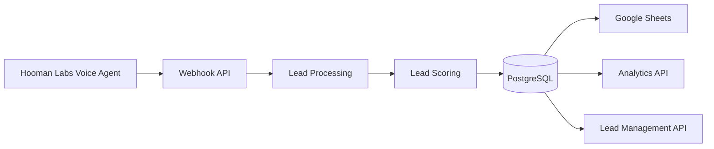

# ✈️ TripGenie AI Backend

An AI-powered backend for a travel lead qualification system built with **FastAPI**, **PostgreSQL**, and **Google Sheets**.

The service receives webhook events from a Hooman Labs Voice Agent, validates and processes travel leads, stores them in PostgreSQL, synchronizes them to Google Sheets, and exposes APIs for analytics and lead management.

---

## Features

- ✅ Secure webhook endpoint for Hooman Labs
- ✅ API Key authentication
- ✅ PostgreSQL persistence
- ✅ Google Sheets synchronization
- ✅ Lead scoring engine (0–100)
- ✅ Duplicate detection using `conversation_id`
- ✅ Lead management APIs
- ✅ Analytics APIs
- ✅ Health, readiness, and liveness endpoints
- ✅ Structured logging
- ✅ Railway deployment

---

## Tech Stack

| Layer | Technology |
|--------|------------|
| Backend | FastAPI |
| Database | PostgreSQL (Neon) |
| ORM | SQLAlchemy 2.0 |
| Migrations | Alembic |
| Validation | Pydantic v2 |
| Spreadsheet | Google Sheets API |
| Deployment | Railway |
| Documentation | Swagger / OpenAPI |

---

## System Architecture



---

# Project Structure

```text
backend/
│
├── app/
│   ├── api/
│   ├── core/
│   ├── db/
│   ├── models/
│   ├── repositories/
│   ├── schemas/
│   ├── services/
│   └── main.py
│
├── alembic/
├── tests/
├── requirements.txt
├── alembic.ini
└── README.md
```

---

# How It Works

1. Hooman Labs finishes a call.
2. Sends a webhook to TripGenie.
3. Backend validates request.
4. Scores the lead.
5. Stores it in PostgreSQL.
6. Synchronizes the lead to Google Sheets.
7. Returns success.

---

# Installation

```bash
git clone <repo>

cd backend

python -m venv .venv

source .venv/bin/activate
```

Windows

```powershell
.\.venv\Scripts\Activate.ps1
```

Install dependencies

```bash
pip install -r requirements.txt
```

---

# Environment Variables

Create a `.env`

```text
DATABASE_URL=

WEBHOOK_API_KEY=

GOOGLE_SHEET_ID=

GOOGLE_WORKSHEET=

GOOGLE_SERVICE_ACCOUNT_JSON=
```

---

# Run

```bash
alembic upgrade head

uvicorn app.main:app --reload
```

Swagger

```
http://127.0.0.1:8000/docs
```

---

# API Endpoints

| Method | Endpoint | Description |
|---------|----------|-------------|
| POST | `/api/v1/webhook/call-end` | Receive Hooman webhook |
| GET | `/api/v1/health` | Health |
| GET | `/api/v1/health/live` | Liveness |
| GET | `/api/v1/health/ready` | Readiness |
| GET | `/api/v1/analytics` | Analytics |
| GET | `/api/v1/leads` | List leads |
| GET | `/api/v1/leads/{id}` | Get lead |
| PUT | `/api/v1/leads/{id}` | Update lead |
| DELETE | `/api/v1/leads/{id}` | Soft delete |

---

# Sample Webhook

```json
{
  "metadata": {
    "event_type": "call.completed",
    "provider": "Hooman Labs"
  },
  "call": {
    "conversation_id": "conv_123",
    "call_duration": 240,
    "outcome": "qualified"
  },
  "lead": {
    "customer_name": "Rahul Sharma",
    "phone": "+919876543210",
    "destination": "Bali",
    "travel_month": "December",
    "travellers": 2,
    "trip_type": "Honeymoon",
    "budget": 180000,
    "hotel_preference": "5 Star",
    "additional_requirements": "Private Pool"
  }
}
```

---

# Lead Scoring

The backend automatically scores leads on a 0–100 scale based on:

- Destination selected
- Travel month
- Budget
- Traveller count
- Trip type
- Customer intent
- Additional requirements

Priority is assigned as:

| Score | Priority |
|--------|----------|
| 75–100 | HOT |
| 45–74 | WARM |
| 0–44 | COLD |

---

# Google Sheets Sync

After a successful database transaction, every qualified lead is synchronized to Google Sheets.

The database remains the source of truth.

---

# Deployment

The application is deployed on Railway.

Startup command

```bash
alembic upgrade head &&
uvicorn app.main:app --host 0.0.0.0 --port $PORT
```

---

# Future Improvements

- CRM integrations
- Background job queue
- Authentication for dashboard
- Email notifications
- Redis caching
- Docker support

---

# License

MIT License
